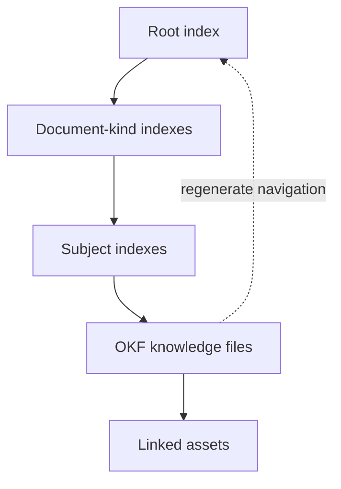

# OttoDoc

> **Documentation that stays useful after the person—or agent—who wrote it moves on.**


**Structured knowledge · Automatic indexes · Agent workflows · Portable Markdown**

[Why OttoDoc](#the-problem) · [How it works](#what-ottodoc-changes) · [Install and maintain](#install-and-maintain) · [Commands](#ottodoc-command-reference)

OttoDoc is a portable, repository-local documentation system for software teams working with humans and coding agents. It gives documentation a defined structure, a repeatable authoring and review process, mechanical quality checks, and adapters that teach supported agents how to follow the same rules.

Instead of treating documentation as a loose collection of Markdown files, OttoDoc treats it as a maintained knowledge system that lives beside the code it explains.

---

## The problem

Most documentation does not fail because teams cannot write Markdown. It fails because there is no shared operating model for deciding:

- what deserves to be documented;
- which kind of document should contain it;
- where that document belongs;
- what evidence supports a claim;
- how a reader can discover it later;
- when it should be updated, replaced, or removed; and
- who checks whether it is still coherent.

Those gaps become more expensive when coding agents join the team. An agent can generate a large amount of plausible prose, but volume is not the same as durable knowledge. Without constraints, human and agent-authored docs tend to drift into duplicated explanations, oversized indexes, stale plans, undocumented decisions, and instructions that no longer match the repository.

The result is familiar: search returns too much, navigation depends on tribal knowledge, important context remains trapped in conversations, and nobody knows which document to trust.

> [!IMPORTANT]
> OttoDoc is not designed to produce more documentation. It is designed to preserve the smallest coherent body of knowledge that future humans and agents can trust.

---

## What OttoDoc changes

### 1. Six kinds create a predictable knowledge tree

OttoDoc supplies the missing contract. It installs a documentation engine under `docs/_system/` and organizes the repository's knowledge into six document kinds:

| Kind | The question it answers |
| --- | --- |
| `runbook` | How do I perform or recover an operation? |
| `reference` | What are the stable facts and interfaces? |
| `decision` | What did we decide, and why? |
| `explanation` | How or why does this system behave this way? |
| `plan` | What bounded future work is proposed? |
| `design` | What visual standard should rendered work conform to? |

Every admitted document follows a small structural contract: machine-readable frontmatter, a summary-first shape, content provenance, and links to related knowledge. The tree remains shallow and predictable. Subject folders are introduced only when the amount of material earns them.

That structure is reinforced by four mechanisms:

1. **A constitution** defines what belongs in the knowledge tree, how documents are admitted or retired, and which rules are authoritative.
2. **A three-role workflow** separates coordination, authorship, and fresh-context review so the same agent does not silently approve its own work.
3. **Deterministic tooling** scaffolds documents, checks conformance, and generates navigation indexes from the documents themselves.
4. **Agent and CI adapters** make the workflow discoverable to Claude, Codex, or Cursor and enforce the same checks in GitHub Actions.

The rules live in one canonical location. Platform-specific files are generated pointers and adapters, so the process does not fragment into a different version for every tool.

### 2. Structured knowledge with the Open Knowledge Format

Every knowledge file in OttoDoc is an [Open Knowledge Format (OKF)](docs/_system/okf-spec.md) concept: one Markdown document representing one coherent unit of knowledge, with YAML frontmatter that makes the document understandable to both people and agents.

OKF is intentionally built from ordinary, durable formats. A knowledge bundle is a directory of Markdown files rather than a proprietary database or opaque export. Humans can read it in any text editor, agents can parse it without a specialized SDK, Git can show meaningful diffs, and the whole body of knowledge can move between tools, repositories, and organizations.

OttoDoc applies a focused repository contract on top of OKF. Every admitted concept identifies:

- its document `type`;
- a human-readable `title`;
- a one-sentence `description` used for navigation and search;
- lowercase `tags` for mechanical discovery; and
- `generated` provenance recording who last made a meaningful content change and when.

Optional OKF fields can record sources, resources, trust signals, or status when they add real value. Unknown OKF-compatible fields are preserved rather than discarded. OttoDoc deliberately does not require a schema registry, central service, embeddings database, or hosted knowledge platform to interpret the files.

The body remains useful without reading the metadata. Each concept opens with a title and summary, then follows the minimum semantic contract for its document kind. Relative links connect related concepts, and broken internal links fail validation. The result is simultaneously readable documentation and structured, portable agent context.

> [!TIP]
> **Result:** Humans can read the knowledge directly, agents can parse it consistently, and Git can track every meaningful change.

### 3. Navigation that rebuilds itself

OttoDoc indexes are generated navigation, not documents that someone must remember to curate. The knowledge files are the source of truth; each `index.md` is a deterministic projection of their locations, titles, types, and descriptions.

Indexes are built from the bottom up:

1. A concept document contributes its title and description to the index nearest to it.
2. Subject indexes summarize the concepts within that subject.
3. Each document-kind index provides an entry point for all knowledge of that kind.
4. The root `docs/index.md` connects the complete tree and points readers to its governance rules.



This gives humans a browsable table of contents and lets agents progressively narrow context from the root, to a kind, to a subject, and finally to the relevant concepts. Because descriptions are carried upward, a reader can decide what to open without loading every document.

Generated indexes solve several maintenance problems at once:

- New documents cannot remain hidden because the next generation pass adds them.
- Deleted documents cannot leave ghost entries because indexes are rebuilt from what actually exists.
- Moves are reflected throughout the navigation tree.
- The same knowledge tree always produces the same index bytes, keeping reviews clean and reproducible.
- CI can regenerate indexes in memory and detect drift without modifying the repository.

An index contains no original knowledge and is never edited by hand. If every index were deleted, OttoDoc could reconstruct all of them from the concept files. Document changes and their regenerated indexes travel together in the same change, so navigation represents the repository at that exact revision.

> [!TIP]
> **Result:** Additions cannot hide, deletions cannot leave ghosts, and agents can progressively narrow context without loading the entire knowledge tree.

### 4. Assets with accountable owners

Not everything that supports documentation belongs in Markdown. OttoDoc accepts non-Markdown assets—images, diagrams, captured data, reference artifacts, and scripts that are themselves documentation content—and treats them as payload, not standalone knowledge. The knowledge about an asset belongs in a concept document.

Every asset lives in an `assets/` folder beside its primary owning document or subject. Its filename is lowercase kebab-case with an extension, and at least one concept document must link to it. Assets do not appear independently in generated indexes; readers and agents discover them through the concept that gives them meaning. Validation rejects orphaned, misplaced, and misnamed assets.

> [!TIP]
> **Result:** Supporting files remain discoverable through the knowledge that explains them instead of becoming an unowned file dump.

### 5. Independent authoring and review

OttoDoc separates documentation coordination, authorship, and fresh-context review. The coordinator decides whether a change creates durable knowledge and scopes the work. The author writes or normalizes the documentation from repository evidence. A reviewer who did not author the change evaluates it from the perspective of a future reader.

This separation prevents one agent from silently deciding what should exist, writing it, and approving its own result. Mechanical validation then checks the parts that should not depend on judgment: structure, metadata, links, assets, generated navigation, and adapter consistency.

> [!TIP]
> **Result:** Documentation receives both accountable judgment and reproducible mechanical checks before it is considered complete.

---

## How it works in practice

A typical documentation change follows this loop:

```text
Assess the code change
        ↓
Decide whether documentation is justified
        ↓
Author or normalize the right document kind
        ↓
Review with fresh context
        ↓
Lint and regenerate indexes
        ↓
Commit the docs with the implementation
```

For agent-driven work, the documentation coordinator assesses impact after a system-changing task. If the repository needs a documentation update, the coordinator delegates the bounded writing task to an author and sends the result to a fresh-context reviewer. Findings return to the author for a limited number of revision cycles; unresolved judgment returns to the repository owner.

Humans can use the same system directly. They may scaffold a conforming document, edit an existing one, or place rough source material in `docs/_intake/` for later normalization. Intake is deliberately inert until someone explicitly asks for it to be processed.

Documentation-only work may inspect the repository, but it may modify only `docs/`. It does not fix code or query live systems. This boundary keeps documentation work reviewable and prevents an apparently harmless docs task from changing operational state.

---

## Install and maintain

Open your agent interface at the root of the repository you want to document and name the platform that repository uses:

```text
OttoDoc install Codex from https://github.com/coder3814/OttoDoc
```

Use `Claude` or `Cursor` instead of `Codex` as appropriate. Install is the one command typed as plain prose, because it runs before any adapter exists. Your agent retrieves the portable engine into `docs/_system/`, creates the six kind directories and `docs/_intake/`, records the chosen platform in `docs/.ottodoc`, generates the platform's adapters — including a slash command for every other OttoDoc verb — and the GitHub documentation check, and builds the initial indexes. If the repository already contains documentation that does not conform, installation stops with no existing content modified—run `OttoDoc check` to see what needs fixing, then install again. Review and commit the installed files.

The file `docs/.ottodoc` records which platforms are configured; it is the single source of truth the tooling converges the repository against. Platform paths such as `.claude/`, `.codex/`, `.cursor/`, `.agents/`, and `.github/workflows/docs.yml` are generated whole and owned by OttoDoc—never edit them, and never edit inside the `ottodoc:begin`/`ottodoc:end` markers in `CLAUDE.md` or `AGENTS.md`. Everything outside those markers is yours and is preserved byte for byte.

Everyday maintenance is four slash commands, typed into any configured agent:

```text
/ottodoc-configure Claude
```

adds a platform (additive—platforms already configured are untouched), so a teammate's tool follows the same contract;

```text
/ottodoc-remove Cursor
```

decommissions one named platform, deleting its generated files and stripping its shared-file block. Removing your last platform is fine: the engine stays installed and CI keeps checking;

```text
/ottodoc-upgrade
```

replaces `docs/_system/` with the newest engine from GitHub and refreshes every recorded platform. It requires a clean git tree, because git is the undo: every lifecycle command leaves an uncommitted diff for review and none keeps backups;

```text
/ottodoc-uninstall
```

removes the engine, every platform, the record, and the CI check while preserving every document, index, asset, and `docs/_intake/`. The tree stays conformant, so reinstalling later restores the indexes byte for byte.

The full management specification—the adapter map, the record file, and converge semantics—lives in [`docs/_system/lifecycle.md`](docs/_system/lifecycle.md).

---

## OttoDoc command reference

Every verb is a slash command in your agent conversation: type `/ottodoc-<verb>` in Claude Code or Cursor, or `$ottodoc-<verb>` in Codex (which has no repository-level slash commands). Follow the command with the target, scope, or instructions it needs. The prose form `OttoDoc <verb> …` works everywhere as a portable equivalent, and is how `install` is invoked, since nothing is installed yet.

Documentation verbs:

| Command | Purpose |
| --- | --- |
| `/ottodoc-assess` | Assess a completed change for documentation impact |
| `/ottodoc-create` | Create a document of a specified kind |
| `/ottodoc-update` | Update an existing document |
| `/ottodoc-rename` | Rename a document file, repair links, and regenerate indexes |
| `/ottodoc-move` | Move a document and repair affected links |
| `/ottodoc-retire` | Deliberately remove documentation that is no longer live |
| `/ottodoc-intake` | Process one named file from `docs/_intake/`, or all of intake when no filename is supplied |
| `/ottodoc-review` | Perform fresh-context review of a document or documentation change |
| `/ottodoc-check` | Verify the entire documentation system without changing it |
| `/ottodoc-fix` | Resolve reported documentation findings and verify the result |
| `/ottodoc-explain` | Explain an applicable OttoDoc rule or document choice |

Lifecycle verbs:

| Command | Purpose |
| --- | --- |
| `OttoDoc install` | Install the OttoDoc engine and configure its initial agent platform (prose only—no adapter exists yet) |
| `/ottodoc-upgrade` | Replace an existing engine with the newest version and refresh every recorded platform |
| `/ottodoc-configure` | Add or refresh one agent platform, leaving the others untouched |
| `/ottodoc-remove` | Decommission one named agent platform |
| `/ottodoc-uninstall` | Remove the engine and every agent platform, keeping the documentation |
| `/ottodoc-check` | Verify the installation matches the record and the canonical engine (the full check above covers the tree too) |

A few examples:

```text
/ottodoc-create runbook "Rotate the webhook signing key" using repository configuration as evidence
/ottodoc-update docs/explanations/api-authentication.md to match the current implementation
/ottodoc-intake cache-design-notes.md
/ottodoc-assess the change I just completed and update the documentation if needed
```

---

## What OttoDoc does—and does not—guarantee

OttoDoc can mechanically enforce structure, metadata, link integrity, generated navigation, adapter consistency, and workflow boundaries. It can make good documentation easier to create, find, review, and maintain.

OttoDoc never expires or deletes admitted documentation automatically. It rejects staleness timers and runs no expiry sweep. When content becomes untrue or unnecessary, changing or removing it is a deliberate, reviewed repository change; Git history remains the archive.

It cannot prove that a claim is true, decide whether a design is wise, or replace accountable human judgment. That is why its process combines automation with evidence, scoped authorship, independent review, and escalation to the repository owner when ambiguity remains.

The goal is not to produce more documentation. The goal is to preserve the smallest coherent body of knowledge that future humans and agents can rely on.

---

## Explore the system

- [`docs/_system/constitution.md`](docs/_system/constitution.md) — the knowledge and governance contract
- [`docs/_system/lifecycle.md`](docs/_system/lifecycle.md) — the installation and platform management spec
- [`docs/_system/okf-spec.md`](docs/_system/okf-spec.md) — the open knowledge format specification
- [`docs/_system/process/workflow.md`](docs/_system/process/workflow.md) — the canonical documentation workflow
- [`docs/_system/process/coordinator.md`](docs/_system/process/coordinator.md) — coordination and delegation rules
- [`docs/_system/process/author.md`](docs/_system/process/author.md) — authoring rules
- [`docs/_system/process/reviewer.md`](docs/_system/process/reviewer.md) — fresh-context review rules
- [`docs/_system/templates`](docs/_system/templates) — templates for each document kind

---

## License

OttoDoc is available under the [MIT License](LICENSE).
