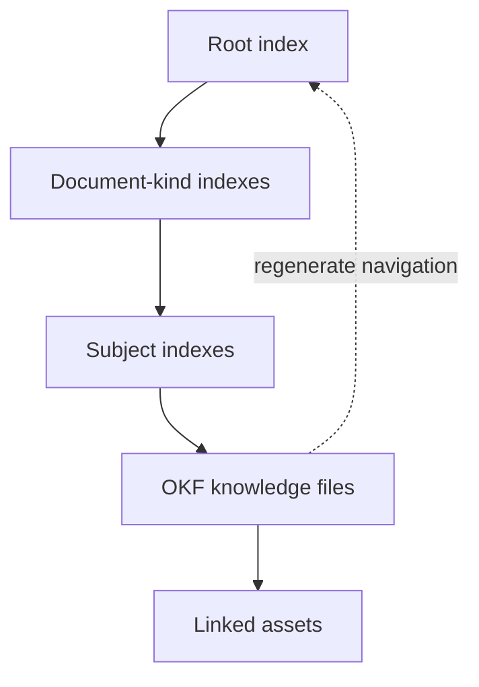

# OttoDoc

> **Documentation that stays useful after the person—or agent—who wrote it moves on.**


**Structured knowledge · Automatic indexes · Agent workflows · Portable Markdown**

[Why OttoDoc](#the-problem) · [How it works](#what-ottodoc-changes) · [Install](#install-ottodoc) · [Commands](#ottodoc-command-reference)

OttoDoc is a portable, repository-local documentation system for software teams working with humans and coding agents. It gives documentation a defined structure, a repeatable authoring and review process, mechanical quality checks, and adapters that teach supported agents how to follow the same rules.

Instead of treating documentation as a loose collection of Markdown files, OttoDoc treats it as a maintained knowledge system that lives beside the code it explains.

---

## The problem

Most documentation does not fail because teams cannot write Markdown. It fails because there is no shared operating model for deciding:

- what deserves to be documented;
- which kind of document should contain it;
- where that document belongs;
- what evidence supports a claim;
- how a reader can discover it later;
- when it should be updated, replaced, or removed; and
- who checks whether it is still coherent.

Those gaps become more expensive when coding agents join the team. An agent can generate a large amount of plausible prose, but volume is not the same as durable knowledge. Without constraints, human and agent-authored docs tend to drift into duplicated explanations, oversized indexes, stale plans, undocumented decisions, and instructions that no longer match the repository.

The result is familiar: search returns too much, navigation depends on tribal knowledge, important context remains trapped in conversations, and nobody knows which document to trust.

> [!IMPORTANT]
> OttoDoc is not designed to produce more documentation. It is designed to preserve the smallest coherent body of knowledge that future humans and agents can trust.

---

## What OttoDoc changes

### 1. Six kinds create a predictable knowledge tree

OttoDoc supplies the missing contract. It installs a documentation engine under `docs/_system/` and organizes the repository's knowledge into six document kinds:

| Kind | The question it answers |
| --- | --- |
| `runbook` | How do I perform or recover an operation? |
| `reference` | What are the stable facts and interfaces? |
| `decision` | What did we decide, and why? |
| `explanation` | How or why does this system behave this way? |
| `plan` | What bounded future work is proposed? |
| `design` | How should a bounded change be built? |

Every admitted document follows a small structural contract: machine-readable frontmatter, a summary-first shape, content provenance, and links to related knowledge. The tree remains shallow and predictable. Subject folders are introduced only when the amount of material earns them.

That structure is reinforced by four mechanisms:

1. **A constitution** defines what belongs in the knowledge tree, how documents are admitted or retired, and which rules are authoritative.
2. **A three-role workflow** separates coordination, authorship, and fresh-context review so the same agent does not silently approve its own work.
3. **Deterministic tooling** scaffolds documents, checks conformance, and generates navigation indexes from the documents themselves.
4. **Agent and CI adapters** make the workflow discoverable to Claude, Codex, or Cursor and enforce the same checks in GitHub Actions.

The rules live in one canonical location. Platform-specific files are generated pointers and adapters, so the process does not fragment into a different version for every tool.

### 2. Structured knowledge with the Open Knowledge Format

Every knowledge file in OttoDoc is an [Open Knowledge Format (OKF)](docs/_system/okf-spec.md) concept: one Markdown document representing one coherent unit of knowledge, with YAML frontmatter that makes the document understandable to both people and agents.

OKF is intentionally built from ordinary, durable formats. A knowledge bundle is a directory of Markdown files rather than a proprietary database or opaque export. Humans can read it in any text editor, agents can parse it without a specialized SDK, Git can show meaningful diffs, and the whole body of knowledge can move between tools, repositories, and organizations.

OttoDoc applies a focused repository contract on top of OKF. Every admitted concept identifies:

- its document `type`;
- a human-readable `title`;
- a one-sentence `description` used for navigation and search;
- lowercase `tags` for mechanical discovery; and
- `generated` provenance recording who last made a meaningful content change and when.

Optional OKF fields can record sources, resources, trust signals, or status when they add real value. Unknown OKF-compatible fields are preserved rather than discarded. OttoDoc deliberately does not require a schema registry, central service, embeddings database, or hosted knowledge platform to interpret the files.

The body remains useful without reading the metadata. Each concept opens with a title and summary, then follows the minimum semantic contract for its document kind. Relative links connect related concepts, and broken internal links fail validation. The result is simultaneously readable documentation and structured, portable agent context.

> [!TIP]
> **Result:** Humans can read the knowledge directly, agents can parse it consistently, and Git can track every meaningful change.

### 3. Navigation that rebuilds itself

OttoDoc indexes are generated navigation, not documents that someone must remember to curate. The knowledge files are the source of truth; each `index.md` is a deterministic projection of their locations, titles, types, and descriptions.

Indexes are built from the bottom up:

1. A concept document contributes its title and description to the index nearest to it.
2. Subject indexes summarize the concepts within that subject.
3. Each document-kind index provides an entry point for all knowledge of that kind.
4. The root `docs/index.md` connects the complete tree and points readers to its governance rules.



This gives humans a browsable table of contents and lets agents progressively narrow context from the root, to a kind, to a subject, and finally to the relevant concepts. Because descriptions are carried upward, a reader can decide what to open without loading every document.

Generated indexes solve several maintenance problems at once:

- New documents cannot remain hidden because the next generation pass adds them.
- Deleted documents cannot leave ghost entries because indexes are rebuilt from what actually exists.
- Moves are reflected throughout the navigation tree.
- Empty and populated sections remain predictable across installations.
- The same knowledge tree always produces the same index bytes, keeping reviews clean and reproducible.
- CI can regenerate indexes in memory and detect drift without modifying the repository.

An index contains no original knowledge and is never edited by hand. If every index were deleted, OttoDoc could reconstruct all of them from the concept files. Document changes and their regenerated indexes travel together in the same change, so navigation represents the repository at that exact revision.

> [!TIP]
> **Result:** Additions cannot hide, deletions cannot leave ghosts, and agents can progressively narrow context without loading the entire knowledge tree.

### 4. Assets with accountable owners

Not everything that supports documentation belongs in Markdown. OttoDoc accepts non-Markdown assets such as:

- images and diagrams, including PNG, JPEG, GIF, WebP, and SVG files;
- structured examples or captured data, including CSV, JSON, YAML, and XML files;
- reference artifacts such as PDFs and text exports;
- scripts that are themselves documentation content, such as SQL, shell, PowerShell, or Python examples; and
- other binary or domain-specific files that a concept needs to explain or preserve.

OttoDoc treats these files as payload, not standalone knowledge. The knowledge about an asset—what it represents, why it matters, how it was produced, and how a reader should use it—belongs in a concept document.

Every asset lives in an `assets/` folder beside its primary owning document or subject. Its filename is lowercase kebab-case with an extension, and at least one concept document must link to it using a relative path. Other documents may link across to the same asset instead of making duplicate copies.

Assets do not appear independently in generated indexes. Readers and agents discover them through the concept that gives them meaning. Validation rejects assets outside an `assets/` folder, Markdown files inside one, nested asset directories, broken asset links, and orphaned assets that no concept document owns. This keeps screenshots, exports, diagrams, and examples from becoming an unexplained file dump.

> [!TIP]
> **Result:** Supporting files remain discoverable through the knowledge that explains them instead of becoming an unowned file dump.

### 5. Independent authoring and review

OttoDoc separates documentation coordination, authorship, and fresh-context review. The coordinator decides whether a change creates durable knowledge and scopes the work. The author writes or normalizes the documentation from repository evidence. A reviewer who did not author the change evaluates it from the perspective of a future reader.

This separation prevents one agent from silently deciding what should exist, writing it, and approving its own result. Mechanical validation then checks the parts that should not depend on judgment: structure, metadata, links, assets, generated navigation, and adapter consistency.

> [!TIP]
> **Result:** Documentation receives both accountable judgment and reproducible mechanical checks before it is considered complete.

---

## Why use it

OttoDoc is useful when documentation needs to remain trustworthy across many changes and many contributors.

- **Readers know where to look.** A small set of document kinds and generated indexes creates predictable navigation.
- **Writers know what “done” means.** Templates, required metadata, lint rules, and review criteria replace vague expectations.
- **Agents receive durable context.** Repository knowledge is structured for retrieval instead of being buried in chats or improvised instruction files.
- **Changes carry their documentation.** The workflow keeps required docs in the same change or pull request as the implementation.
- **Review has independence.** A fresh-context reviewer tests whether the result works for someone who did not author it.
- **Indexes cannot quietly drift.** They are reproducible build products, checked in CI, and never hand-maintained.
- **Adoption is controlled.** Bootstrap creates missing structure but does not import, rewrite, move, or delete existing documentation.
- **The system is portable.** Everything authoritative is contained in `docs/_system/` and can be installed in another repository.

OttoDoc is intentionally local and inspectable. It does not require a documentation service, database, hosted portal, or live-system access. The Markdown remains in your repository and evolves through normal version control.

---

## How it works in practice

A typical documentation change follows this loop:

```text
Assess the code change
        ↓
Decide whether documentation is justified
        ↓
Author or normalize the right document kind
        ↓
Review with fresh context
        ↓
Lint and regenerate indexes
        ↓
Commit the docs with the implementation
```

For agent-driven work, the documentation coordinator assesses impact after a system-changing task. If the repository needs a documentation update, the coordinator delegates the bounded writing task to an author and sends the result to a fresh-context reviewer. Findings return to the author for a limited number of revision cycles; unresolved judgment returns to the repository owner.

Humans can use the same system directly. They may scaffold a conforming document, edit an existing one, or place rough source material in `docs/_intake/` for later normalization. Intake is deliberately inert until someone explicitly asks for it to be processed.

Documentation-only work may inspect the repository, but it may modify only `docs/`. It does not fix code or query live systems. This boundary keeps documentation work reviewable and prevents an apparently harmless docs task from changing operational state.

---

## Install OttoDoc

### `OttoDoc install`

#### Purpose

Add OttoDoc's canonical documentation system and one agent-platform adapter to a repository. Installation creates the initial knowledge tree, generated navigation, platform instructions, and GitHub documentation check without silently rewriting existing documentation.

Open your agent interface at the root of the repository you want to document and name the platform that repository uses.

#### Example

```text
OttoDoc install Codex from https://github.com/coder3814/OttoDoc
```

Use `Claude` or `Cursor` instead of `Codex` when appropriate.

#### What happens

Your agent retrieves the portable engine, installs the adapter for the platform you selected, creates the initial knowledge tree, generates its navigation, adds the GitHub documentation check, and verifies the result. The implementation is automated by repository-local tooling, but users do not need to invoke that tooling directly.

Only one platform is installed per request. OttoDoc does not guess which agent interface you use or install every integration automatically. If the repository already contains documentation that cannot be admitted safely, installation stops without rewriting, moving, or deleting it.

After installation, the documentation tree begins with this structure:

```text
docs/
|-- decisions/
|   `-- index.md
|-- design/
|   `-- index.md
|-- explanations/
|   `-- index.md
|-- plans/
|   `-- index.md
|-- reference/
|   `-- index.md
|-- runbooks/
|   `-- index.md
|-- _system/
|   `-- ...
`-- index.md
```

Each kind exists from the beginning, even when it contains no documents. Its generated `index.md` keeps the directory visible in Git and provides a stable navigation entry point. As documents are added, OttoDoc regenerates these indexes from the knowledge tree.

Review and commit the installed files. From that point forward, contributors, agents, and CI share the same documentation contract.

---

## OttoDoc command reference

OttoDoc is designed to be used through action commands in your agent conversation. The installed adapter routes each command through the appropriate workflow and handles scaffolding, validation, review, and index generation behind the scenes.

These commands are portable across Claude, Codex, and Cursor:

| Command | Purpose |
| --- | --- |
| `OttoDoc install` | Install OttoDoc for one agent platform |
| `OttoDoc assess` | Assess a completed change for documentation impact |
| `OttoDoc create` | Create a document of a specified kind |
| `OttoDoc update` | Update an existing document |
| `OttoDoc move` | Move a document and repair affected links |
| `OttoDoc retire` | Deliberately remove documentation that is no longer live |
| `OttoDoc intake` | Process one named intake file, or all Intake when no filename is supplied |
| `OttoDoc review` | Perform fresh-context review of a document or documentation change |
| `OttoDoc check` | Verify the entire documentation system without changing it |
| `OttoDoc fix` | Resolve reported documentation findings and verify the result |
| `OttoDoc explain` | Explain an applicable OttoDoc rule or document choice |

Command names are shown in lowercase for consistency. Follow a command with the target, scope, or instructions it needs.

### `OttoDoc assess`

#### Purpose

Determine whether a completed implementation change requires documentation before declaring the work finished. Use it after changing code, configuration, infrastructure, schemas, workflows, or other repository behavior. OttoDoc inspects the bounded change and relevant repository evidence; it does not assume that every change deserves a document.

#### Example

```text
OttoDoc assess the change I just completed and update the documentation if needed
```

#### What happens

The coordinator may conclude that the current knowledge tree already explains the change or that no durable knowledge was created. When documentation is justified, OttoDoc identifies the affected concepts, delegates authoring and fresh-context review, validates the result, and keeps the documentation in the same change as the implementation.

### `OttoDoc create`

#### Purpose

Add a new, independently useful concept to the knowledge tree. Use it when the knowledge does not belong in an existing document. Specify one of the six document kinds—`runbook`, `reference`, `decision`, `explanation`, `plan`, or `design`—and describe the concept the document must cover.

#### Example

```text
OttoDoc create decision "Use short-lived preview environments"
```

You can also provide evidence, constraints, or a desired scope:

```text
OttoDoc create runbook "Rotate the webhook signing key" using repository configuration and operational code as evidence
```

#### What happens

OttoDoc confirms that the requested kind fits the reader's question, chooses the correct template and location, checks repository evidence, writes the document, sends it through fresh-context review, validates it, and updates generated navigation. If the concept belongs in an existing document instead, OttoDoc should recommend an update rather than create duplication.

### `OttoDoc update`

#### Purpose

Bring an existing document back into alignment with current repository truth or improve it without changing its fundamental concept. Use it for changed behavior, missing evidence, unclear guidance, or a bounded correction.

#### Example

```text
OttoDoc update docs/explanations/api-authentication.md to match the current implementation
```

#### What happens

OttoDoc preserves useful content, verifies repository-defined claims, updates material provenance, performs fresh-context review, validates the document contract, and regenerates affected navigation.

### `OttoDoc move`

#### Purpose

Relocate a document when its current kind or subject placement makes it misleading or difficult to discover.

#### Example

```text
OttoDoc move docs/reference/retry-policy.md to the reliability subject
```

#### What happens

OttoDoc validates the destination, moves the document without changing its identity unnecessarily, repairs inbound and outbound links, removes empty subject folders when appropriate, and regenerates affected indexes.

### `OttoDoc retire`

#### Purpose

Remove a document that is no longer true, needed, or part of the live system. Retirement is deliberate cleanup, not archival.

#### Example

```text
OttoDoc retire docs/plans/legacy-deployment.md after confirming its useful knowledge exists elsewhere
```

#### What happens

OttoDoc checks that useful current knowledge is preserved elsewhere, repairs affected links, removes the live file, regenerates navigation, and relies on Git history as the archive.

Documentation is never expired or removed on a timer. A retirement request is assessed as a deliberate repository change, with Git history retained as the archive.

### `OttoDoc intake`

#### Purpose

Turn non-authoritative drafts, notes, and source material into reviewed repository knowledge. Place source files directly in `docs/_intake/`, then invoke the command with one optional filename:

```text
OttoDoc intake [filename]
```

#### Examples

Process one file:

```text
OttoDoc intake cache-design-notes.md
```

Only that file is assessed and processed. Omit the filename when the intended scope is every file currently in Intake:

Process all Intake:

```text
OttoDoc intake
```

#### What happens

The filename must identify one direct child of `docs/_intake/`; paths, directories, multiple filenames, and filename patterns are not valid parameters. Intake remains non-authoritative until the command is invoked. OttoDoc preserves intended meaning and explicitly human-provided facts, checks repository-defined claims, returns material ambiguity to the user, and determines whether the source should produce one document, several documents, updates to existing knowledge, or no live documentation. Successfully consumed source files are removed in the same reviewed change.

### `OttoDoc review`

#### Purpose

Evaluate documentation from the perspective of a future reader who did not author it. Use it on one document or a bounded documentation change when you want an independent assessment of accuracy, usefulness, scope, concision, structure, evidence, and links.

#### Example

```text
OttoDoc review docs/runbooks/restore-search-index.md
```

#### What happens

The reviewer checks the requested scope against repository evidence and reports findings. Review is read-only: it does not silently rewrite the document or implementation.

### `OttoDoc check`

#### Purpose

Perform a non-modifying health check of the installed documentation system. Use it before committing documentation, while diagnosing CI failures, or whenever you want a complete list of mechanical violations.

#### Example

```text
OttoDoc check
```

#### What happens

OttoDoc verifies directory structure, required metadata and sections, filenames, links, assets, generated navigation, template completion, and adapter consistency.

The result is a report; `OttoDoc check` does not fix the findings or make editorial decisions.

### `OttoDoc fix`

#### Purpose

Resolve a known, bounded set of documentation findings. Use it after `OttoDoc check`, `OttoDoc review`, or a user-provided findings list.

#### Example

```text
OttoDoc fix the findings from the last documentation check
```

#### What happens

OttoDoc sends the work through the authoring flow, limits changes to documentation, regenerates navigation where needed, obtains fresh-context review, and verifies the final state.

If a finding requires an implementation change or an unresolved product decision, OttoDoc reports it instead of expanding the documentation task beyond its authority.

### `OttoDoc explain`

#### Purpose

Ask how OttoDoc applies to a documentation question without requesting a repository change. Use it to choose a document kind, understand placement, learn what evidence is expected, or clarify a governance rule.

#### Example

```text
OttoDoc explain where a proposed design belongs and what evidence it should include
```

#### What happens

OttoDoc answers from the installed constitution and workflow in the context of the repository. It explains the applicable rule without modifying documentation.

The constitution and workflow remain available for direct inspection, but users can ask OttoDoc to explain the applicable rule in context instead of learning the underlying implementation.

---

## What OttoDoc does—and does not—guarantee

OttoDoc can mechanically enforce structure, metadata, link integrity, generated navigation, adapter consistency, and workflow boundaries. It can make good documentation easier to create, find, review, and maintain.

OttoDoc never expires or deletes admitted documentation automatically. It rejects staleness timers and runs no expiry sweep. When content becomes untrue or unnecessary, changing or removing it is a deliberate, reviewed repository change; Git history remains the archive.

It cannot prove that a claim is true, decide whether a design is wise, or replace accountable human judgment. That is why its process combines automation with evidence, scoped authorship, independent review, and escalation to the repository owner when ambiguity remains.

The goal is not to produce more documentation. The goal is to preserve the smallest coherent body of knowledge that future humans and agents can rely on.

---

## Explore the system

- [`docs/_system/constitution.md`](docs/_system/constitution.md) — the knowledge and governance contract
- [`docs/_system/okf-spec.md`](docs/_system/okf-spec.md) — the open knowledge format specification
- [`docs/_system/process/workflow.md`](docs/_system/process/workflow.md) — the canonical documentation workflow
- [`docs/_system/process/coordinator.md`](docs/_system/process/coordinator.md) — coordination and delegation rules
- [`docs/_system/process/author.md`](docs/_system/process/author.md) — authoring rules
- [`docs/_system/process/reviewer.md`](docs/_system/process/reviewer.md) — fresh-context review rules
- [`docs/_system/templates`](docs/_system/templates) — templates for each document kind

---

## License

OttoDoc is available under the [MIT License](LICENSE).
